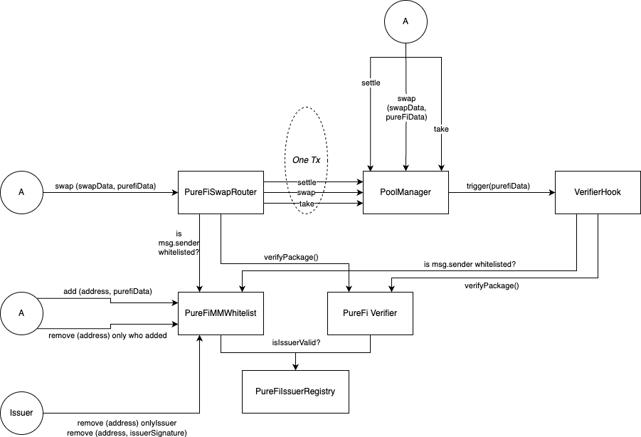

# PureFi Compliant DEX based on Uniswap V4

## Overview

VerifierHook is a compliance-focused hook designed for Uniswap V4. It implements various checks and verifications for swap operations, liquidity provisions, and donations, ensuring that all transactions meet specified compliance criteria.

## Features

- Compliance checks using PureFi verification packages
- Whitelist management for market makers
- Dynamic rule management for flexible compliance enforcement
- Supports various Uniswap V4 operations including swaps, liquidity additions/removals, and donations

## Prerequisites

- Solidity ^0.8.26
- Uniswap V4 core and periphery contracts
- OpenZeppelin contracts
- PureFi SDK

## Installation

1. Clone the repository:
   ```
   git clone https://github.com/your-username/verifier-hook-uniswap-v4.git
   ```

2. Install dependencies:
   ```
   forge install
   ```
   
3. Run test

   ```
   forge test -vvv --match-path test/VerifierHook.t.sol --fork-url https://rpc.ankr.com/eth_sepolia --chain-id 11155111 --fork-block-number 6099766
   ```

## Contract Structure

The main contract is `VerifierHook.sol`, which inherits from `BaseHook` and `Ownable`. Key components include:

- `IPureFiVerifier`: Interface for PureFi verification
- `PureFiMMWhitelist`: Whitelist contract for authorized market makers
- `tokenA` and `tokenB`: IERC20 tokens for the pool
- Mappings for expected rule IDs, router whitelist, and quoter whitelist

## Usage

### Deployment

Deploy the VerifierHook contract with the following parameters:

- `IPoolManager _poolManager`: Uniswap V4 Pool Manager address
- `IPureFiVerifier _verifier`: PureFi Verifier contract address
- `IERC20 _tokenA`: Address of the first token in the pool
- `IERC20 _tokenB`: Address of the second token in the pool
- `PureFiMMWhitelist _whitelist`: Address of the PureFi MM Whitelist contract
- `address _owner`: Address of the contract owner

### Key Functions

1. **Router and Quoter Management**
   - `enlistRouter(address router)`: Whitelist a router
   - `delistRouter(address router)`: Remove a router from the whitelist
   - `enlistQuoter(address quoter)`: Whitelist a quoter
   - `delistQuoter(address quoter)`: Remove a quoter from the whitelist

2. **Rule Management**
   - `setExpectedRuleIds(uint256[] calldata ruleIds)`: Set expected rule IDs
   - `unsetExpectedRuleId(uint256[] calldata ruleIds)`: Unset expected rule IDs

3. **Hook Operations**
   - `beforeSwap`: Verifies PureFi data and swap parameters
   - `afterSwap`: Performs additional checks for exact input swaps
   - `beforeAddLiquidity`: Verifies PureFi data before liquidity addition
   - `beforeRemoveLiquidity`: Verifies PureFi data before liquidity removal
   - `beforeDonate`: Verifies PureFi data before donations

### Diagran



#### Steps to success flow

1. MarketMaker whitelist router on PureFiMMWhitelist contract;

2. User trying to swap through PureFiSwapRouter or MarketMaker router;

3. PureFiVerifier checks that payload is correct and call issuerValid() from PureFiIssuerRegistry

4. If user not whitelisted - he must proceed all rule-provided operations(KYC etc.);

5. When all rule based procedures successfully proceeded by user - he can make swap, modifyLiquidity, etc.